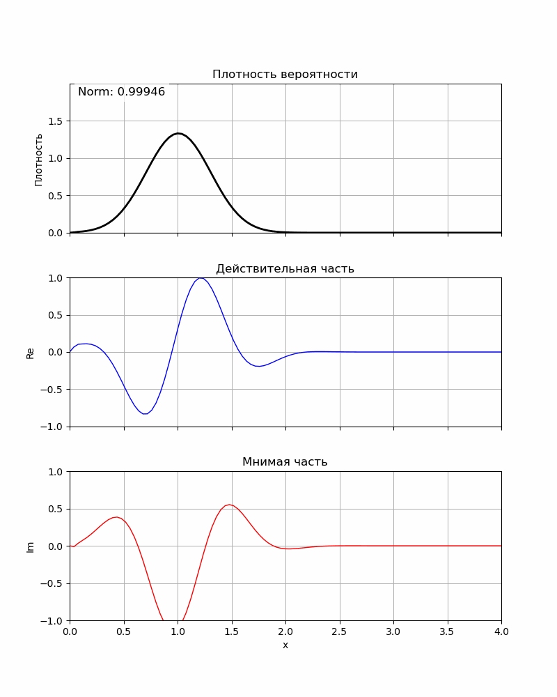
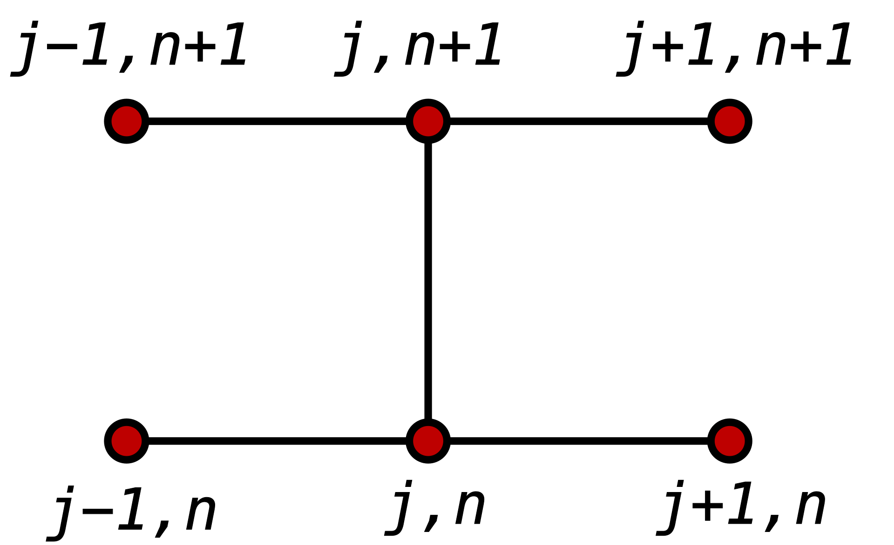
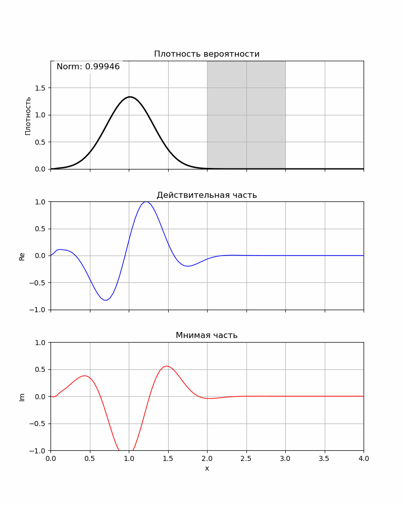

# Задача 1
Решить уравнение Шредингера в случае непрерывных переменных. На семинаре мы получили

$$
\begin{cases}
\psi(x, t) = \frac{1}{\gamma} \left[\psi(x + \Delta x, t + \Delta t) + \psi(x - \Delta x, t + \Delta t) + \left(\gamma - 2 - 2m\Delta x^2 V(x)\right)\cdot \psi(x, t + \Delta t) \right]\\
\psi(0, t) = \psi(L, t) = 0\\
\psi(x, 0) = \psi_0(x)
\end{cases}
$$

где $\gamma = \frac{2m\Delta x^2}{\Delta t} i$ и $V(x)$ - потенциал, который мы вольны задавать. Я решил задавать число точек на сетке: $N$ - для числа точек по оси $x$, $M$ - по оси $t$, где время наблюдения $T$. Тогда 

$$
\Delta x = \frac{L}{N},\quad \Delta t = \frac{T}{M}
$$

В свою очередь можно ввести замену, необходимую для векторизации нашего уравнения:

$$
\psi(x, t) \rightarrow v^{(i)}_t
$$

И тогда можно записать обычную СЛАУ

$$
\boldsymbol{v^{(t)}} = A \boldsymbol{v^{(t + 1)}}
$$

где матрица $A$ - триангулярная и выглядит как

$$
A = 
\begin{pmatrix}
    1 & 0 & 0 & \dots  & 0 & 0 & 0 & \dots & 0\\
    \frac{1}{\gamma} & 1 - \frac{2}{\gamma} - \frac{2m \Delta x^2 V(x_1)}{\gamma} & \frac{1}{\gamma} & \dots & 0 & 0 & 0& \dots & 0\\
    & \ddots & & & & & & & \\
    0& \dots & 0 & \dots& 0& \dots & \frac{1}{\gamma} & 1 - \frac{2}{\gamma} - \frac{2m \Delta x^2 V(x_{N})}{\gamma} & \frac{1}{\gamma}\\
    0& \dots & 0 & \dots& 0& \dots & 0 & 0 & 1
\end{pmatrix}
$$

Эта матрица сильно разряжена и ее лучше всего хранить в `scipy.sparse.diag`, а решать СЛАУ с помощью `scipy.sparse.spsolve`.

В тестовых случаях мы будем пользоваться обычным прямоугольным потенциальным барьером

$$
V(x) = \begin{cases}
0,\ \text{если}\ x \notin[x_b, x_b + w_b]\\
H,\ \text{если}\ x \in[x_b, x_b + w_b]
\end{cases}
$$

где $H$ - высота барьера, $x_b$ - координата "начала" барьера, $w_b$ - его ширина. 

Во всех тестовых случаях 

$$
\psi_0(x) = \left(\frac{1}{\sqrt{2\pi \sigma^2}} e^{-\frac{(x - x_0)^2}{2 \sigma^2}}\right)^{1/2} \cdot e^{ik_0 x}
$$

Параметры, которые могут варьироваться в задаче:

$$
x_0, \sigma, k_0, H, x_b, w_b
$$

## Тест 1: Отсутствие потенциала

В таком случае наш волновой пакет должен просто расплываться, а затем отразиться от "бортов" бесконечной ямы. 

Для

$$
    L = 4.0,\ x_0 = 1.0,\ \sigma = 0.3,\ m = 1.0,\ k_0 = 10.0,\ N = 1000,\ M = 1000,\ T = 0.5
$$

Для пакета, распространяющегося в другую сторону,

$$
    L = 4.0,\ x_0 = 3.0,\ \sigma = 0.3,\ m = 1.0,\ k_0 = -15.0
$$

Видно, что данная схема является затухающей, то есть не сохраняется норма волновой функции. Это можно показать очень просто, так как 

$$
\frac{\psi^{(t + 1)} - \psi^{(t)}}{\Delta t} = -i \hat{H} \psi^{(t + 1)}
$$

Что можно расписать как

$$
\psi^{(t + 1)} = \frac{1}{1 + i \hat{H} \Delta t} \psi^{(t)} = G \psi^{(t)}
$$

Где 

$$
|G| = \frac{1}{\sqrt{1 + E^2 \Delta t^2}} = \frac{1}{\sqrt{1 + \left(\frac{\Delta t}{2m \Delta x^2}\right)^2}} < 1
$$

где $E_{max} \approx \frac{k_0^2}{2m}$ в случае свободной эволюции (кинетическая энергия частицы) и $ E_{err} \approx \frac{2}{m \Delta x^2}$ (ошибка сетки). Тогда

$$
|G_{free}| = \frac{1}{\sqrt{1 + \left(\left(\frac{k_0^2 }{2m} + \frac{2}{m \Delta x^2}\right) \Delta t \right)^2}} \Rightarrow \frac{T}{M} \ll \frac{m}{\frac{k_0^2}{2} + \frac{2}{\Delta x^2}} = \frac{m}{\frac{k_0^2}{2} + \frac{2N^2}{L^2}}
$$

Таким образом норма тоже не возрастает с каждым шагом, а только убывает. И контроллировать убывание нормы мы можем с помощью уравнения выше. Из него видно, что шаг по времени убывает с ростом $k_0$ и $N$ - числа узлов на сетке по оси $x$. 

Для примера уменьшу $k_0$ и $N$, а также возьму $M$, подходящий условию выше

$$
    L = 4.0,\ x_0 = 1.0,\ \sigma = 0.3,\ m = 1.0,\ k_0 = 5.0,\ N = 100,\ M = 63100,\ T = 0.5
$$

Видно, что норма стала уменьшаться не так резво.

Теперь давайте посмотрим за большее время наблюдения $T = 2$

$$
    L = 4.0,\ x_0 = 1.0,\ \sigma = 0.3,\ m = 1.0,\ k_0 = 5.0,\ N = 100,\ M = 252500,\ T = 2
$$

## Тест 2: Стационарные состояния

Возьмем состояния, которые являются собственными для гамильтониана в отсутствие барьера

$$
\psi_n(x) = \sqrt{\frac{2}{L}} \sin \frac{n \pi x}{L}
$$

Плотность вероятности не должна меняться со временем для таких решений.

Для $n=1$ и $L = 4.0,\ m = 1.0$

Для $n=2$ и $L = 4.0,\ m = 1.0$

Как видно решения остаются стационарными. 
## Пример с барьером
Добавим барьер 

$$
L = 4,\ x_b = 2,\ w_b = 1,\ H = 10,\ k_0 = 5,\ x_0 = 1,\ \sigma = 0.3
$$

Сделаем его просто огромным!!!

$$
L = 4,\ x_b = 2,\ w_b = 1,\ H = 1000,\ k_0 = 5,\ x_0 = 1,\ \sigma = 0.3
$$

Теперь сделаю два барьера

$$
L = 4,\ x_b^{(1)} = 1.5,\ x_b^{(2)} = 2.5,\ w_b^{(1, 2)} = 0.5,\ H = 10,\ k_0 = 5,\ x_0 = 1,\ \sigma = 0.3
$$

# Решение, сохраняющее норму

## Схема Кранка-Николсона
Подробнее про нее вот тут [ссылка](https://en.wikipedia.org/wiki/Crank–Nicolson_method).

Уравнение Шредингера на таком шаблоне будет выглядеть как

$$
\frac{v_{i+1}^{(t+1)} - 2v_i^{(t+1)} + v_{i-1}^{(t+1)} + v_{i+1}^{(t)} - 2v_i^{(t)} + v_{i-1}^{(t)}}{2\Delta x^2} = -2mi \left[ \frac{v_i^{(t+1)} - v_i^{(t)}}{\Delta t} + i V(x_i) \frac{v_i^{(t+1)} + v_i^{(t)}}{2} \right]
$$

Введем безразмерный параметр $\gamma$:

$$
\gamma = \frac{2 m i \Delta x^2}{\Delta t}
$$

После группировки слагаемых получаем систему линейных алгебраических уравнений вида:

$$
A \vec{v}^{(t+1)} = B \vec{v}^{(t)}
$$

где 

$$
A = \begin{pmatrix}
1 & 0 & 0 & 0 & \dots\\
1 & d_0 & 1 & 0 & \dots \\
0 & 1 & d_0 &1 & \dots \\
\dots & \dots & \dots & & \vdots\\
\dots & \dots & \dots & 0 & 1
\end{pmatrix}, \quad \text{где } d_0 = 2\gamma - 2 - 2m \Delta x^2 V(x_i)
$$

$$
B = \begin{pmatrix}
1 & 0 & 0 & 0 & \dots\\
-1 & \tilde{d}_0 & -1 & 0 & \dots \\
0 & -1 & \tilde{d}_0 &-1 & \dots \\
\dots & \dots & \dots & & \vdots\\
\dots & \dots & \dots & 0 & 1
\end{pmatrix}, \quad \text{где } \tilde{d}_0 = 2\gamma + 2 + 2m \Delta x^2 V(x_i)
$$

Это решение без диссипации энергии в виду того, что

$$
\psi^{(t + 1)} = \frac{1 - \frac{i}{2}\Delta t \hat{H}}{1 + \frac{i}{2} \Delta t \hat{H}} \psi^{(t)} \Rightarrow |G| = \sqrt{\frac{1 + \frac{E^2 \Delta t^2}{4}}{1 + \frac{E^2 \Delta t^2}{4}}} = 1
$$

Но у таких решений график будет "дрожать", то есть каждый раз будет накручиваться фаза, отличная от $-iE\Delta t$. А точнее

$$
\Delta \phi = -2 \arctan \frac{E \Delta t}{2} + E\Delta t \approx \frac{(E \Delta t)^3}{12}
$$

Таким образом с уменьшением шага по времени мы уменьшаем "дрожь" фазы. А также с уменьшением $E$ (уменьшением $k_0$ и $N$).

## Свободная эволюция
Сначала посмотрим на "вибрации" фазы

$$
L = 4,\ k_0 = 5,\ x_0 = 1,\ \sigma = 0.3,\ T=0.5,\ N = 1000,\ M = 1000
$$

А теперь я увеличу шаг сетки по $t$ и уменьшу по $x$

$$
L = 4,\ k_0 = 5,\ x_0 = 1,\ \sigma = 0.3,\ T=0.5,\ N = 100,\ M = 10000
$$

Как видно, вибрации уменьшились. При этом норма сохраняется!!!

## Барьер
$$
L = 4,\ x_b = 2,\ w_b = 1,\ H = 10,\ k_0 = 5,\ x_0 = 1,\ \sigma = 0.3,\ T=1,\ N = 100,\ M = 10000
$$

