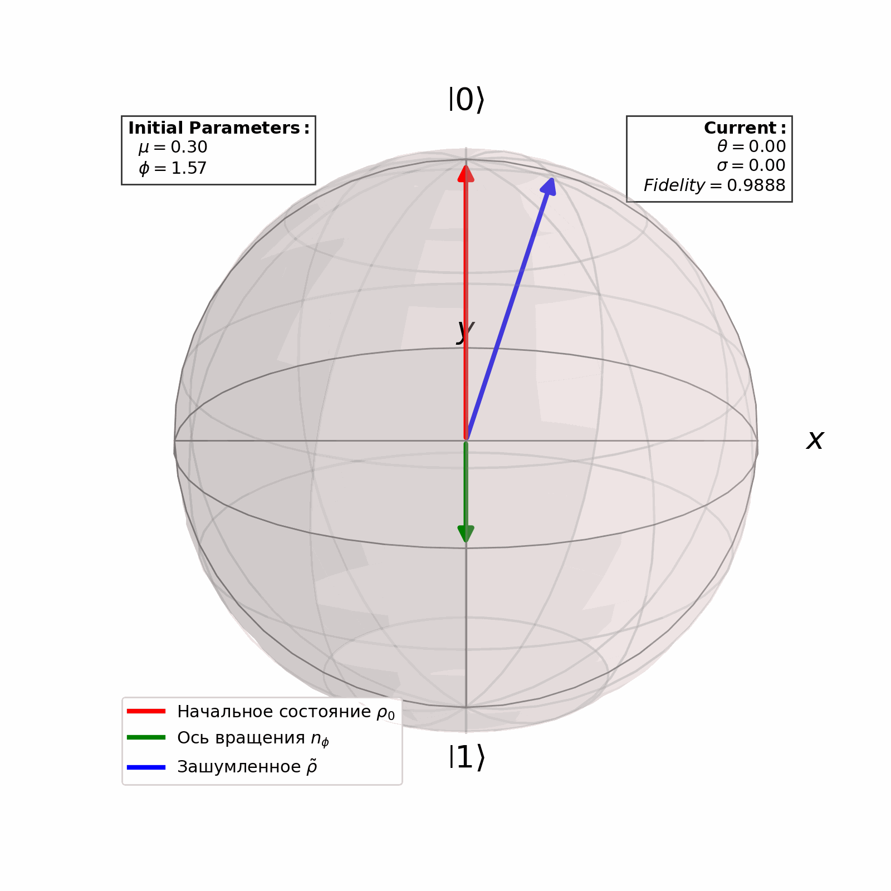

# Ошибка поворота состояния вокруг оси

В данной задаче мы фиксируем ось $n_\phi = (\cos \phi, \sin \phi, 0)$, а также и угол поворота $\theta$. Однако этот угол поворота обладает ошибкой $\delta \theta$, которая распределена нормально $p_{\mu, \sigma} (\delta \theta)$. Таким образом матрица плотности после такого "шумного" поворота будет

$$
\tilde{\rho} = \int_{-\infty}^{\infty} d (\delta \theta) p_{\mu, \sigma}(\delta \theta)\ \hat{R}_{n_{\phi}}(\theta + \delta \theta) \rho \hat{R}^{\dagger}_{n_{\phi}}(\theta + \delta \theta)
$$

Были получены операторы Крауса для этой задачи

$$
E_1 = \frac{1}{2} \sqrt{\frac{1 + e^{-\sigma^2/2}}{1 - \cos (\theta + \mu)}} \left[ i \sin(\theta + \mu) \hat{\mathbb{I}} - (1 - \cos (\theta + \mu)) \hat{N}^* \right]
$$

$$
E_2 = \frac{1}{2} \sqrt{\frac{1 - e^{-\sigma^2/2}}{1 + \cos (\theta + \mu)}} \left[ i \sin(\theta + \mu) \hat{\mathbb{I}} + (1 + \cos (\theta + \mu)) \hat{N}^* \right]
$$

где $\hat{N}^{*} = \cos \phi\ \hat{\sigma}_x - \sin \phi\ \hat{\sigma}_y$.

Проверка численного расчета операторов Крауса проведена в файле `test.py` (сходятся 1000 из 1000 экспериментов). В программе `kraus.py` проводится пример одной из проверок.

В программе `state_evol.py` выводится эволюция состояния на сфере Блоха, где считается, что $\sigma$ для шума растет линейно с ростом угла поворота $\theta$. Красным выделяется эволюция состояния без шума, а синим - с шумом. 

Получилось прикольно.