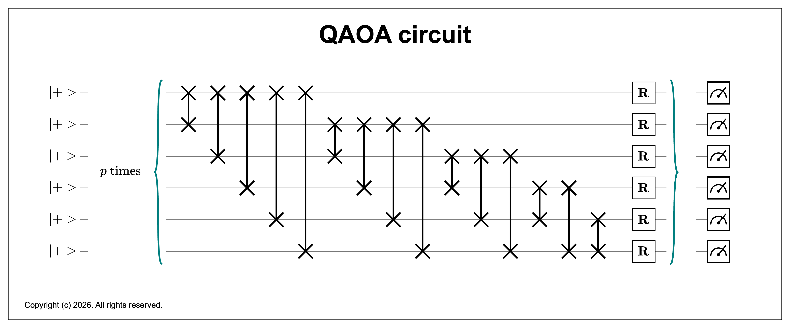
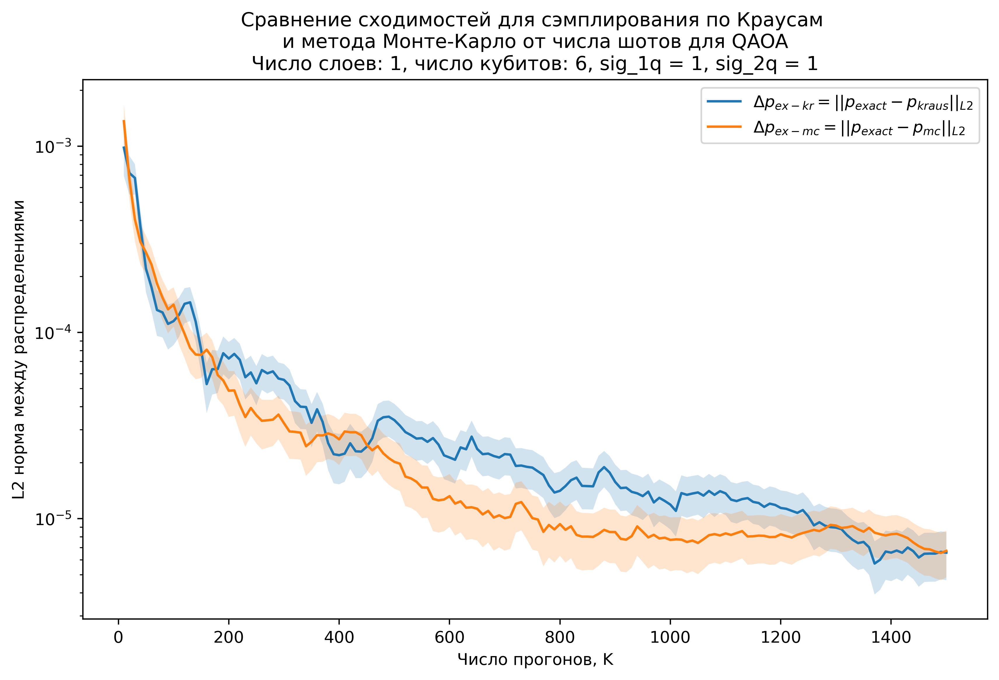
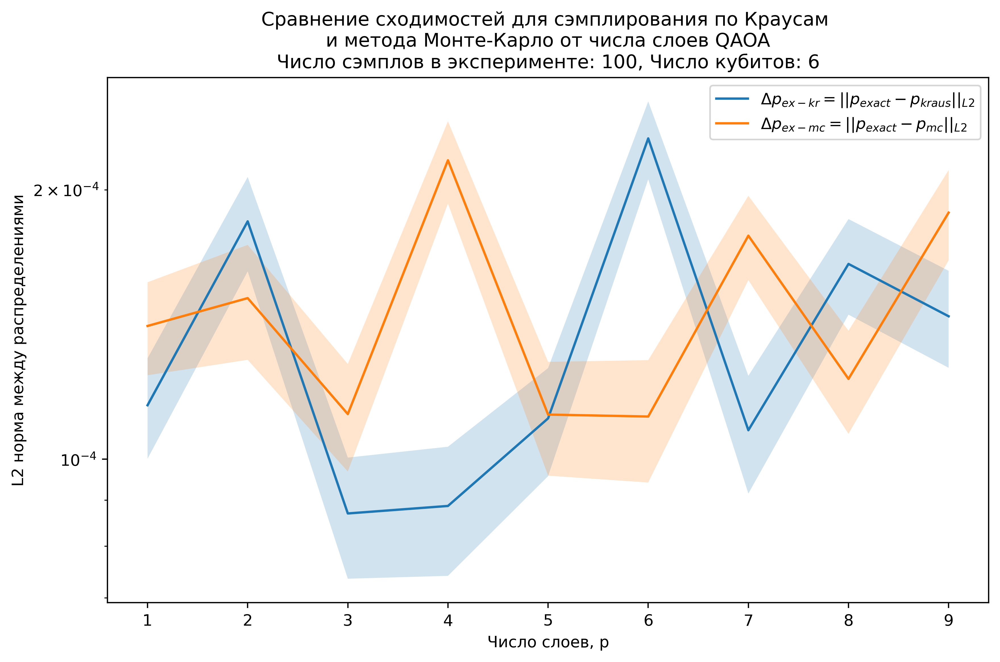
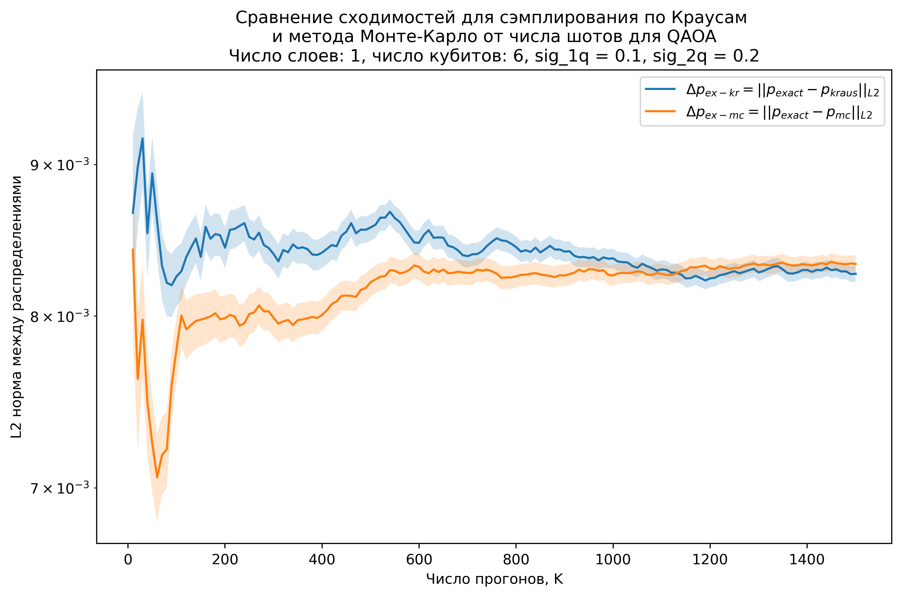
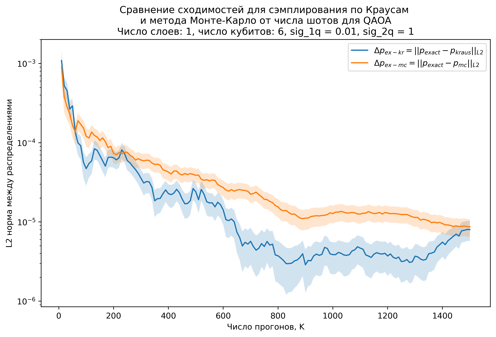
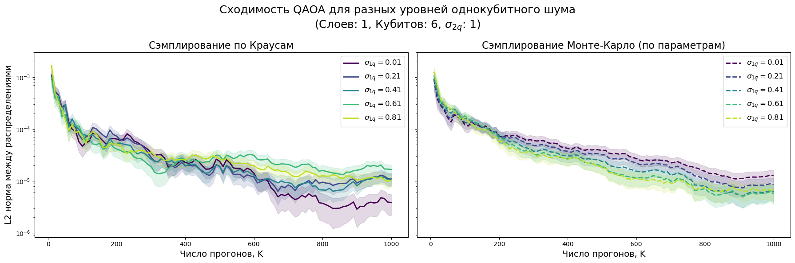
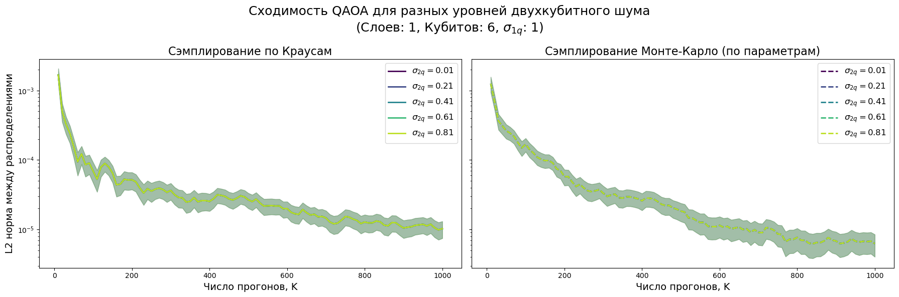

# Моделирование шумного QAOA

## Постановка задачи

Каждая двухкубитная схема между кубитами $k$ и $j$ задается выражением

$$
\hat{ZZ}_{kj} = \exp \left(-i \gamma_{kj} \hat{Z} \otimes \hat{Z} \right) = \text{diag} \left(e^{-i\gamma_{kj}},e^{i\gamma_{kj}}, e^{i\gamma_{kj}}, e^{-i\gamma_{kj}} \right)
$$

где параметр $\gamma_{kj} \sim \mathbb{N} \left(\gamma_{kj}^{(0)}, \sigma^2_{2q} \right)$.

Каждый однокубитный гейт на регистре $k$

$$
R = R_{\phi = 0}(\beta_k) = \cos \frac{\beta_k}{2}\ \hat{\mathbb{I}} - i\sin \frac{\beta_k}{2}\ \hat{X}
$$

где $\beta_k \sim \mathbb{N} \left(\beta^{(0)}_{k}, \sigma^2_{1q}\right)$. 

Такая схема повторяется $p$ раз, а затем происходит измерение битовой строчки. Стоит следующая задача:
1. Рассчитать операторы Крауса для двухкубитной операции и однокубитной операции.
2. Получить супероператор всей схемы (разумеется, численно) и вычислить точные значения итовых вероятностей для битовых строчек.
3. Провести эксперимент с сэмплингом, устроенном на прогоне полной схемы для различных сгенерированных параметрах $\gamma_{kj}, \beta_k$.
4. Провести эксперимент с сэмплингом, где каждый раз выбирается тот или иной оператор Крауса для каждой шумной операции. 

Все это релизуем через тензорные сети.

## Операторы Крауса и супероператоры
### Однокубитные операции
В прошлой ДЗ были получены следующее операторы Крауса
$$
E_1 = \frac{1}{2} \sqrt{\frac{1 + e^{-\sigma^2/2}}{1 - \cos (\theta + \mu)}} \left[ i \sin(\theta + \mu) \hat{\mathbb{I}} - (1 - \cos (\theta + \mu)) \hat{N}^* \right]
$$

$$
E_2 = \frac{1}{2} \sqrt{\frac{1 - e^{-\sigma^2/2}}{1 + \cos (\theta + \mu)}} \left[ i \sin(\theta + \mu) \hat{\mathbb{I}} + (1 + \cos (\theta + \mu)) \hat{N}^* \right]
$$

где $\hat{N}^{*} = \cos \phi\ \hat{\sigma}_x - \sin \phi\ \hat{\sigma}_y$. В нашем случае $\phi = 0$, значит $\hat{N} = \hat{N}^{*} = \hat{X}$, $\mu = \beta^{(0)}_k$, $\sigma = \sigma_{1q}$, $\theta = 0$. В итоге получим следующие операторы Крауса:

$$
E^{(k)}_1 = \frac{1}{2} \sqrt{\frac{1 + e^{-\sigma^2_{1q}/2}}{1 - \cos \beta^{(0)}_{k}}} \left[ i \sin(\beta^{(0)}_{k}) \hat{\mathbb{I}} - (1 - \cos (\beta^{(0)}_{k})) \hat{X} \right]
$$

$$
E^{(k)}_2 = \frac{1}{2} \sqrt{\frac{1 - e^{-\sigma^2_{1q}/2}}{1 + \cos \beta^{(0)}_{k}}} \left[ i \sin(\beta^{(0)}_{k}) \hat{\mathbb{I}} + (1 + \cos (\beta^{(0)}_{k})) \hat{X} \right]
$$

действующие на $k$-ый кубит. 

Супероператор выражается следующим образом

$$
G^{(k)}_{1q} = \frac{1}{2}\begin{pmatrix}
1 + C & -iS & iS & 1-C\\
-iS & 1+C & 1-C & iS\\
iS & 1 - C & 1 + C & -iS\\
1 - C & iS & -iS & 1+C
\end{pmatrix}
$$
где $S = \sin \beta^{(0)}_k\ e^{-\sigma^2_{1q}/2},\ C = \cos \beta^{(0)}_k\ e^{-\sigma^2_{1q}/2} $.

### Двухкубитные операции

Для начала имеем эволючию матрицы плотности после взаимодействия с двухкубитным гейтом между кубитами $k, j$:

$$
\rho_{\text{out}} = \int d\gamma_{kj}\ p(\gamma_{kj})\ \hat{ZZ}_{kj}\rho_{in} \hat{ZZ}^{\dagger}_{kj}
$$

После векторизации

$$
\text{vec}(\rho_{out}) =  \underbrace{\int d\gamma_{kj}\ p(\gamma_{kj})\ \hat{ZZ}^{*}_{kj} \otimes \hat{ZZ}_{kj}}_{G^{(kj)}_{2q}}\ \text{vec}(\rho_{in})
$$

Итого

$$
G^{(kj)}_{2q} = \int_{-\infty}^{\infty}d\gamma_{kj}\ p(\gamma_{kj})\ \text{diag}\left(e^{-i\gamma_{kj}}, e^{i\gamma_{kj}}, e^{i\gamma_{kj}}, e^{-i\gamma_{kj}} \right) \otimes \text{diag}\left(e^{i\gamma_{kj}}, e^{-i\gamma_{kj}}, e^{-i\gamma_{kj}}, e^{i\gamma_{kj}} \right) = \\
=  \int_{-\infty}^{\infty}d\gamma_{kj}\ p(\gamma_{kj})\  \text{diag} \left[1, e^{2i\gamma_{kj}}, e^{2i\gamma_{kj}}, 1, e^{-2i\gamma_{kj}},1, 1, e^{-2i\gamma_{kj}}, e^{-2i\gamma_{kj}},1, 1, e^{-2i\gamma_{kj}}, 1, e^{2i\gamma_{kj}}, e^{2i\gamma_{kj}}, 1\right]
$$

Где надо взять интеграл

$$
I(\pm \gamma_{kj}) = \int_{-\infty}^{\infty}d\gamma_{kj}\ \frac{1}{\sqrt{2\pi}\sigma_{2q}}\exp\left(-\frac{(\gamma_{kj} - \gamma_{kj}^{(0)})^2}{2\sigma^2_{2q}} \right)\ e^{\pm2i\gamma_{kj}} = \dots = e^{-2\sigma_{2q}^2}\ e^{\pm2i\gamma_{kj}^{(0)}}
$$

Таким образом конечный вид супероператора

$$
G^{(kj)}_{2q} = \text{diag}\left[1, e^{-2\sigma_{2q}^2}e^{2i\gamma_{kj}^{(0)}}, e^{-2\sigma_{2q}^2}e^{2i\gamma_{kj}^{(0)}}, 1,e^{-2\sigma_{2q}^2}e^{-2i\gamma_{kj}^{(0)}}, 1, 1, e^{-2\sigma_{2q}^2}e^{-2i\gamma_{kj}^{(0)}}, e^{-2\sigma_{2q}^2}e^{-2i\gamma_{kj}^{(0)}}, 1, 1, e^{-2\sigma_{2q}^2}e^{-2i\gamma_{kj}^{(0)}}, 1, e^{-2\sigma_{2q}^2}e^{2i\gamma_{kj}^{(0)}}, e^{-2\sigma_{2q}^2}e^{2i\gamma_{kj}^{(0)}}, 1 \right]
$$

Можно также получить операторы Крауса (не векторизуя эволюцию матрицы плотности)

$$
K_1^{(kj)} = \sqrt{\frac{1 + e^{-2\sigma_{2q}^2}}{2}} \exp \left(-i \gamma^{(0)}_{kj} \hat{Z} \otimes \hat{Z} \right) = \sqrt{\frac{1 + e^{-2\sigma_{2q}^2}}{2}}\ \text{diag} \left[ e^{-i\gamma_{kj}}, e^{i\gamma_{kj}}, e^{i\gamma_{kj}}, e^{-i\gamma_{kj}}\right]
$$

$$
K_2^{(kj)} = \sqrt{\frac{1 - e^{-2\sigma_{2q}^2}}{2}} \exp \left(-i \gamma^{(0)}_{kj} \hat{Z} \otimes \hat{Z} \right) (\hat{Z} \otimes \hat{Z}) =\sqrt{\frac{1 - e^{-2\sigma_{2q}^2}}{2}}  \text{diag} \left[ e^{-i\gamma_{kj}},-e^{i\gamma_{kj}}, -e^{i\gamma_{kj}}, e^{-i\gamma_{kj}}\right]
$$

## Эволюция схемы в векторизованном формализме

Матрицу плотности на входе после 1-го слоя можно описать следующим образом

$$
\text{vec}(\rho_{out}) = \underbrace{\left[ \prod_{k = 0}^{5} \prod_{j = k+1}^{5} G_{2q}^{(kj)} \right] \cdot \left[\prod_{k = 0}^{5} G^{(k)}_{1q} \right]}_{\mathcal{G}}\ \text{vec}(\rho_{in})
$$

где супероператоры действуют только на выбранную подсистему, то есть имееют блочную структуру, где для остальных кубитов преобразование тождественное, кроме выбранных $k$ или $k,j$. Для $p$ слоев QAOA будем иметь

$$
\text{vec} (\rho_{out}) = \mathcal{G}^{p}\ \text{vec}(\rho_{in})
$$

## Реализация 

Симуляторы для тензорного сетей были взяты из прошлого семестра с курса "Квантвые алгоритмы". Симулятор для чистых состояний `EinsumQuantumSimulator` и симулятор для матрицы плотности `DensityMatrixSimulator` реализованы в `quantum_sim.py`. Все используемые гейтовые схемы и супероператоры прописаны в `gates.py`.

Функция, вычисляющая точное распределение выходных вероятностей реализована в `exact_QAOA_probs.py`. Симуляции через сэмплирование по параметрам $\gamma_{kj}, \beta_k$ и через операторы Крауса реализованы в программмах `monte_carlo_simulation.py` и `kraus_samples_simulation.py` соответственно. 

Все графики рассчитывались в `check.ipynb`.

## Результаты

Для $\sigma_{1q} = \sigma_{2q} = 1$ получил следующий график сходимости распределений от числа сэмплов

Видно, что поведение сэмплов по Краусам более резкое, чем сэмплы из Монте-Карло. Также, сходимость обоих методов примерно одинаковая.

Также провел эксперимент в зависимости от числа слоев $p$

Тут сказать особо нечего - методы тождественны.

Для $\sigma_{1q} = 0.1, \sigma_{2q} = 0.2$

Уже совершено другая зависимость - есть плато на уровне ошибки $0.008$. Это может возникать в связи с тем, что при больших ошибках $\sigma_{1,2q}$ состояние стремится к смешанному (недиагональные элементы зануляются), что статистически легче повторить. Поэтому для 1-го эксперимента результат вышел таким образом.

Для $\sigma_{1q} = 0.01, \sigma_{2q} = 1$

Тут видно лучшую сходимость результата для сэмплирования по Краусам, хоть поведение графика более резкое, чем сэмплирование методом Монте-Карло.

В связи с этим построил графики для сходимостей от числа прогонов для различных $\sigma$ для двух методов сэмплирования.

Итого: результат сильно зависит как от числа прогонов $K$, так и значения однокубитного шума $\sigma_{1q}$.