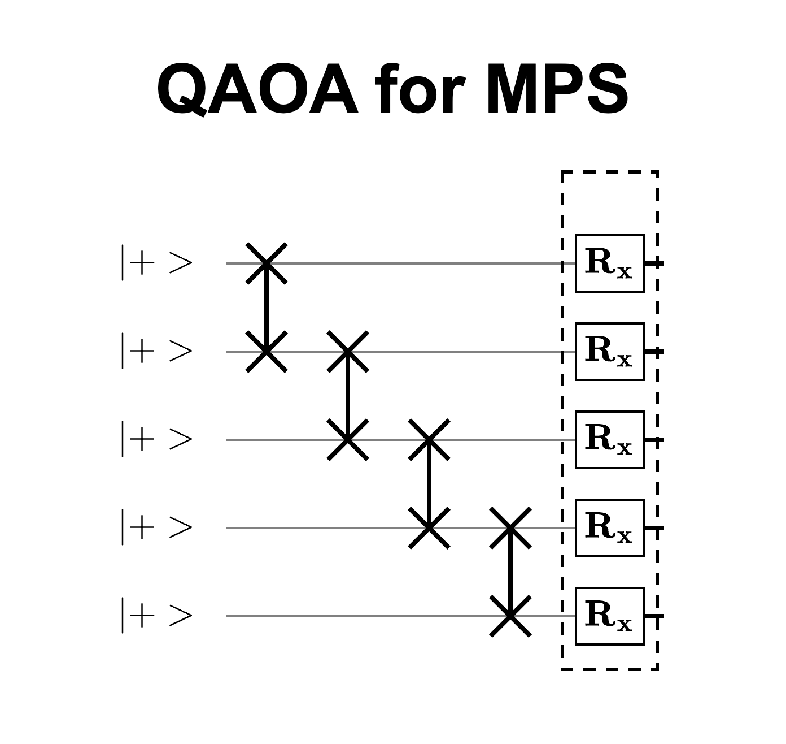
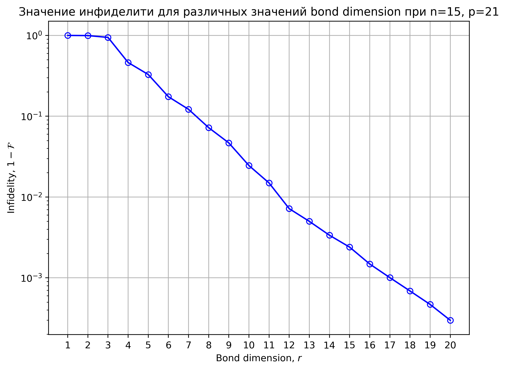
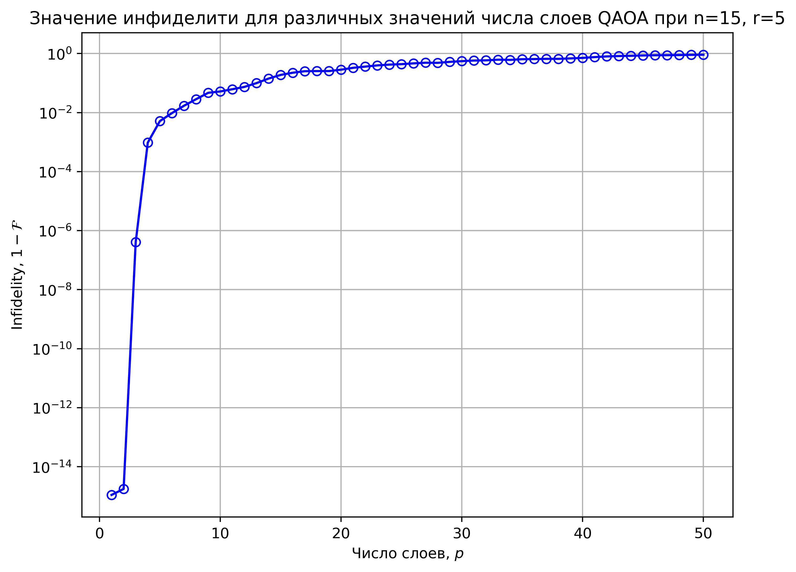
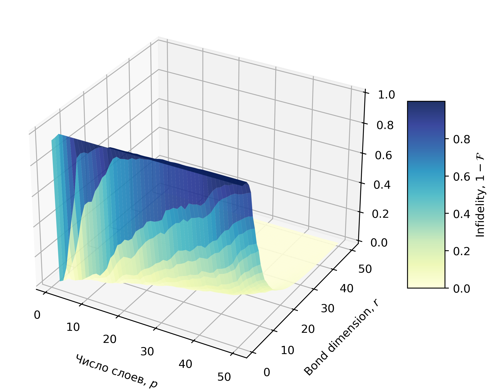
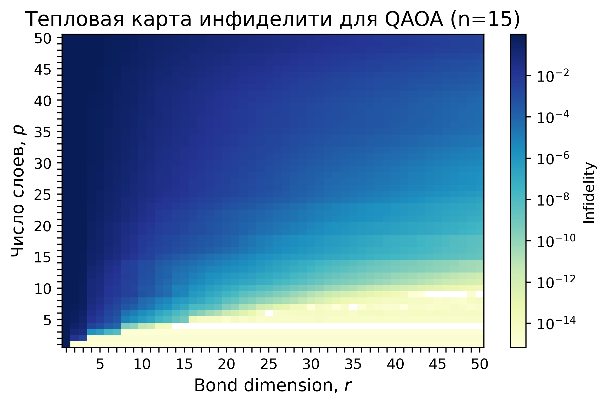
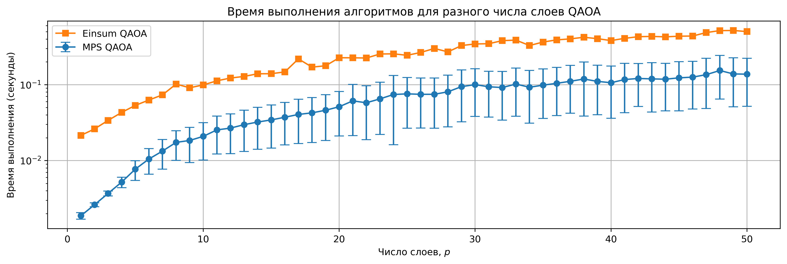
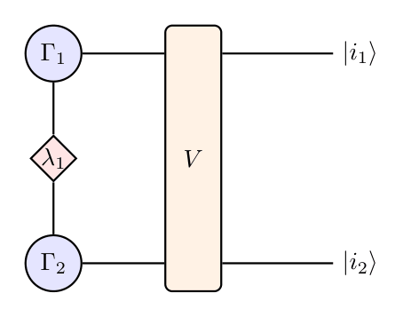

# Matrix product state (MPS) в задаче QAOA

## Постановка задачи

Опять имеем схему QAOA, но теперь она будет для $n = 15$ кубитов. Что требуется сделать:

1. Найти выходное распределение вероятности (по выходным битстрингам) через на тензорном вычислителе.

2. Реализовать MPS метод и найти различные распределения вероятностей уже для различного значения $r$ (о нем подробнее далее).

3. Посчитать фиделити $\mathcal{F}$ в зависимости от значения $r$ и $p$ (числа слоев) (сравниваем с симуляцией на тензорном вычислителе).

## Вычисление на тензорном вычислителе

Тут особо нечего писать - все уже было реализовано в предыдущих домаших работах. Только в данном случае у нас двухкубитные $\hat{ZZ}$ гейты между соседними кубитами.

## MPS метод

Тут будем опираться на работу [G. Vidal. Efficient classical simulation of
slightly entangled quantum computations](https://arxiv.org/pdf/quant-ph/0301063). Там декомпозиция исходного $n$-кубитного состояния представляется в виде

$$
\ket{\psi} = \Gamma^{(1)} \lambda^{(1)} \dots  \lambda^{(n-1)}\Gamma^{(n)}
$$

где $\Gamma^{(l)} = \Gamma^{(l),i}_{\alpha, \alpha^{'}}$ - имеет три индексы, причем $i = 0,1$, $\alpha, \alpha^{'} = 1, \dots, \chi$ - до максимального ранга в разложении Шмидта. Множители $\lambda^{(l)}$ хранят в себе коэффициенты Шмидта при разделении до $l+1$ кубита. 

Если у нас состояния факторизованы (сеперабельные), то тогда мы можем очень просто задать то тогда векторы $\lambda$ задаются очень просто - это просто $[1.0]$. Также максимальные ранги Шмидта равно $1$. Так как в нашей задаче исходное состояние это 

$$
\ket{\psi} = \ket{+}_1 \otimes \ket{+}_2 \otimes \dots \otimes \ket{+}_n,
$$

то определить изначальные вид тензоров очень просто 

$$
\Gamma^{(l),0}_{11} = \Gamma^{(l),1}_{11} =  \frac{1}{\sqrt{2}}, \quad \lambda^{(l)} = [1.0].
$$

Теперь поочередно рассмотрим действие однокубитного и двухкубитного гейта. 

### Однокубитный гейт
С ним все очень просто. Пусть мы наклдываем однокубитный гейт $U$ на кубит $l$. Тогда преобразуется только тензор $\Gamma$

$$
\Gamma^{(l), i}_{\alpha \beta} \rightarrow \sum_{j} U^{i}_{j} \Gamma^{(l), j}_{\alpha \beta}
$$

### Двухкубитный гейт

Все двухкубитные гейты у нас между двумя соседними кубитами (в схему QAOA). Это сильно упрощает жизнь, так как для них существует быстрый алгоритм. Мы будем использовать метод SVD разложения, где ограничиваем число испольуемых собственных значений число $r$. Имплементация этого метода следующая:

1. Сначала мы сворачиваем тензор $\Gamma^{(l)}$ с $\lambda^{(l-1)}$ и $\lambda^{(l)}$ и $\Gamma^{(l+1)}$ с $\lambda^{(l+1)}$. Получим новые тензоры $A_L$ и $B_R$.

2. Затем сворачиваем полученные тензоры с 2q-гейтом V и получаем тензор $\Theta$.

3. Этот тензор раскладываем `np.reshape` в матрицу 4x4, затем применяем SVD, выделяем только первые $r$ компонент, т.е.

$$
\Theta \rightarrow \mathrm{reshape} \rightarrow M \rightarrow^{SVD} U S V^{\dagger} \rightarrow U_r, S_r, V^{\dagger}_r
$$

4. Далее `reshape` матриц $U_r$, $V_r^{\dagger}$ в тензоры $\Gamma^{(l)}, \Gamma^{(l+1)}$, а $S_r$ в ромбик $\lambda^{(l)}$. Затем сворачиваем с обратными тензорами $S^{-1}$ с каждой стороны (это необходимо для сохранение нормы). 

5. Меняем тензоры в списке и ура!!!

### Получение комплексных амплитуд

Для битовой строчки $\ket{i_1, i_2, \dots, i_n}$ комплексная амплитуда будет выражаться как

$$
c_{i_1, \dots, i_n} = \sum_{\alpha_1, \dots, \alpha_{n-1}} \Gamma^{(1), i_1}_{\alpha_1} \lambda^{(l)}_{\alpha_1} \Gamma^{(2), i_2}_{\alpha_1 \alpha_2} \dots \lambda^{(n-1)}_{\alpha_{n-1}} \Gamma^{(n)}_{\alpha_n}
$$

# Результаты

Везде фиксировалось число кубитов $n = 15$, а варьировалось число слоев $p$ QAOA и значение $r$.

Удобнее смотреть на инфиделити, так что вот резлуьтаты для $p = 21$ при разных значениях $r$

Также обратное при фиксированном $r$

А теперь самое интересное - меняется и то, и другое. Я построил поверхность по этому случаю. 

А также тепловую карту

Ну и ради интереса сравнил время вычислений

Очевидно, что при малой связности (запутанности) MPS на голову выше тензорного вычислителя.

Также я решил сдеалть генератор красивых tikz MPS изображений, но как-то не нашел применение здесь. Выглядят они вот так

